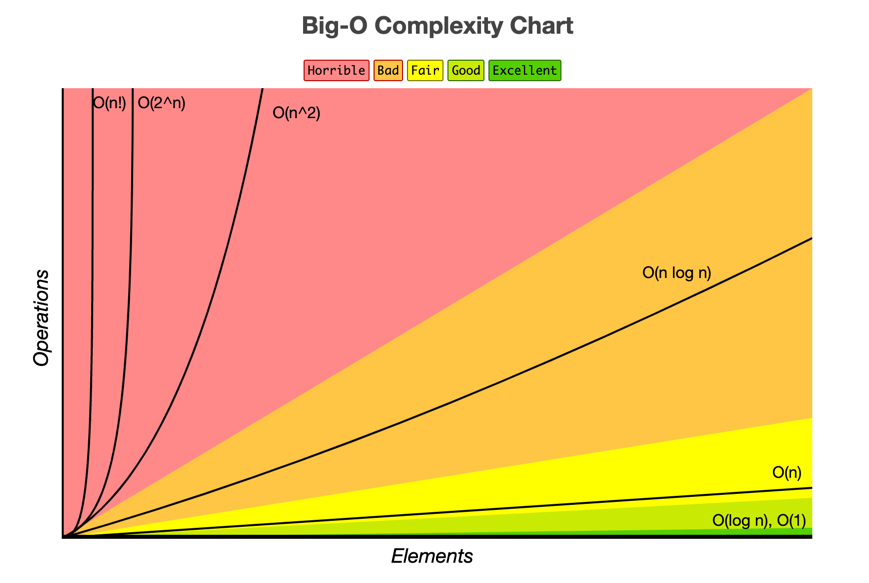

# Big Notation

   

## Index

* [Big Notation 이란?](#Big-Notation-이란?)
* [Time Complexity 종류](#Time-Complexity-종류)
* [법칙](#법칙)
* [Big O 시간 복잡도 그래프 및 효율](#Big-O-시간-복잡도-그래프-및-효율)

---

   

## Big Notation 이란?

알고리즘 및 함수의 복잡도를 단순화 하는 표기법 이다.  
알고리즘의 성능을 테스트 할 수 있는 지표가 된다.   
주로 최악의 경우를 다룬다.  
점근적 표기법으로 불리기도 하며, 크게 3가지 표기법이 있다.  

Big Notation List:

* **Big O :: 빅 오**
  * 최악의 경우의 수 (상한)

* **Big θ :: 빅 세타**
  * 최선과 최악의 중간의 수 (평균)

* **Big Ω :: 빅 오메가**
  * 최선의 경우의 수 (하한)

   

## Time Complexity 종류

* **O(1) [*Constant*]**
  * 한번의 실행으로 끝이 난다.
  * [코드 확인하기](https://github.com/chaeheedongs/DataStructure/blob/main/src/a_big_o/A_constant.java)
  

* **O(n) [*Linear*]**
  * 경우의 수를 찾기 위해 처음부터 끝까지 찾는다.
  * 일차원 이다. (한줄)
  * [코드 확인하기](https://github.com/chaeheedongs/DataStructure/blob/main/src/a_big_o/B_linear.java)

* **O(n²) [*Quadratic*]**
  * 경우의 수를 찾기 위해 처음부터 끝까지 n제곱으로 찾는다.
  * n * n => n²
  * 이차원 이다. (체스판)
  * [코드 확인하기](https://github.com/chaeheedongs/DataStructure/blob/main/src/a_big_o/C_quadratic.java)

* **O(log₂(n)) [*Logarithmic*]**
  * 로그 방정식을 활용해 찾는다.
  * 전체 데이터 길이를 반씩 쪼개어 찾는다. 
  * [코드 확인하기](https://github.com/chaeheedongs/DataStructure/blob/main/src/a_big_o/D_logarithmic.java)
  
   

## 법칙

* **Drop Constants**
  * 상수를 제거 한다.
  * ~~~java
    /**
      * n + n = 2n
      * O(2n) <-- Drop Constants
      * => O(n)
      */
    
    // function result : n + n = 2n
    public void func(int n) {
    
      // n
      for(int i = 0; i < n; i++) {
          System.out.println("i = " + i);
      }
      
      // n
      for(int i = 0; i < n; i++) {
          System.out.println("i = " + i);
      }
    
    }
    ~~~

 

* **Drop Non-Dominants**
  * 우세한 항을 남기고  나머지는 제외 한다.
  * ~~~java
    /**
      * (n * n) + n = n² + n
      * O(n² + n) <-- Drop Non-Dominants
      * => O(n²)
      */
    
    // function result : (n * n) + n
    public void func(int n) {
        
      // n * n
      for(int i = 0; i < n; i++) {
        for(int j = 0; j < n; j++) {
          System.out.println("i, j = " + j + ", " + j);
        }
      }
      
      // n
      for(int i = 0; i < n; i++) {
          System.out.println("i = " + i);
      }
    
    }
    ~~~

 

* **Different Terms For Inputs**
  * 함수의 매개변수 개수에 따른 처리 방식이 다를 수 있다.
  * ~~~java
    /**
      * a가 4이고, b가 65535일 때,
      * O(a + b) 는 O(n) 이라 할 수 없고,
      * O(a * b) 는 O(n²) 이라 할 수 없어,
      * 함수에 입력되는 매개변수 개수에 따라 다르게 봐야 한다.
      */
    
    // function result : (n * n) + n
    public void func(int a, int b) {
      
      // O(a)
      for(int i = 0; i < a; i++) {
        System.out.println("i = " + i);
      }
      
      // O(b)
      for(int i = 0; i < b; i++) {
        System.out.println("i = " + i);
      }
      
      // O(a * b)
      for(int i = 0; i < a; i++) {
        for(int j = 0; j < b; j++) {
          System.out.println("i, j = " + i + ", " + j);
      }
    }
    ~~~

   

## Big O 시간 복잡도 그래프 및 효율

### 시간 복잡도 그래프

*출처 : [https://www.bigocheatsheet.com/](https://www.bigocheatsheet.com/)*

  

### 시간 복잡도 효율

> [Faster]  O(1) -> O(log₂(n)) -> (O(n)) -> O(n²) [Slower]

   

