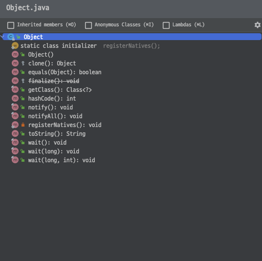

# Class 와 Pointer

   

## Index

* [Class 란?](#Class-란?)
* [Class 생성자 만들기](#Class-생성자-만들기)
* [Class 생성하기](#Class-생성하기)
* [Class 메모리 할당](#Class-메모리-할당)

---

   

## Class 란?

Class란 객체를 만드는 틀 이라고 이해하면 된다.  
아래 클래스를 선언하는 코드이다.

[클래스 관련 자세한 설명 보기]()

~~~java
public class User {

    private String name;
    private GENDER gender;
    private int age;
    private String email;
    private String address;
    
}
~~~

   

## Class 생성자 만들기

Class를 생성하는 방법은 Class 생성자를 이용하는 방법이다.  
Class 생성자는 접근제어자와 Class이름으로 구성되어 있으며,  
주로 매개변수를 받아 Class 필드에 할당을 한다.

[코드 확인하기]()

~~~java
public class User {

    private String name;
    private GENDER gender;
    private int age;
    private String email;
    private String address;
    
    // No Arguments Constructor
    public User() { }

    public User(String name) {
        this(name, null, 0, null, null);
    }

    // All Arguments Constructor
    public User(String name, GENDER gender, int age, String email, String address) {
        this.name = name;
        this.gender = gender;
        this.age = age;
        this.email = email;
        this.address = address;
    }
}
~~~

   

## Class 생성하기

> 선언 방법 :: 클래스 변수명 = **new 클래스()**

**'new'** 키워드를 사용하여 Class를 **'인스턴스화'** 한다.  
인스턴스화 된 Class는 메모리(JVM-Heap)에 저장이 되며,  
해당 Class는 메모리의 주소 값을 할당 받는다.

[코드 확인하기]()

~~~java
public static void main(String[] args) {
        
    // 메모리에 올라가기 전
    User user1 = null; // <- 선언만 하였음
    User user2 = null; // <- 선언만 하였음
    User user3 = null; // <- 선언만 하였음
        
    // 메모리에 올라감
    user1 = new User("foo"); // <- 인스턴스화
    user2 = new User("bar"); // <- 인스턴스화
    user3 = new User("baz"); // <- 인스턴스화
        
    // 메모리 주소 확인하기
    user1.hashCode(); // -654929307
    user2.hashCode(); // -308014286
    user3.hashCode(); // -300626118
}
~~~

   

## Class 메모리 할당

Class는 객체이며, 모든 객체는 Object를 상속 받는다.  
Object는 객체의 최상위 부모 객체이다.

따라서 Class를 만들어도 Object의 메서드들을 사용할 수 있다.  
그리고 이러한 자료들을 통틀어 Reference Type 이라고 한다.

 

Object를 상속 받는 모든 객체는 값을 저장할 때 주소값을 저장하게 된다.  
그리고 Primitive Type 처럼 값을 할당하면 Reference Type은 주소 값을 복사하게 된다.  
이것을 Call By Reference 라고 한다.  

Call By Reference로 객체를 복사하면 두 객체의 주소값이 동일해지며,  
한 쪽에서 값 변경이 일어 난다면 다른 복사한 쪽 에서도 변경이 일어난다.

[코드 확인하기]()

~~~java
public static void main(String[] args){
    
    User user1 = new User("foo");
    User user2 = new User("bar");

    System.out.println();
    System.out.println("Create User Object And Show Hash Code");
    System.out.println("user1 hash code : " + user1.hashCode());
    System.out.println("user2 hash code : " + user2.hashCode());
    System.out.println("-------------------------------------");
    System.out.println();

    
    
    // Call By Reference (Swallow Copy)
    user2 = user1;

    System.out.println();
    System.out.println("Is Sames User Object HashCode?");
    System.out.println("user1 hash code : " + user1.hashCode());
    System.out.println("user2 hash code : " + user2.hashCode());
    System.out.println("user1 name : " + user1.getName());
    System.out.println("user2 name : " + user2.getName());
    System.out.println("-------------------------------------");
    System.out.println();
        
    
    
    user1.setName("ChangeName");

    System.out.println();
    System.out.println("Is Sames User Object Name?");
    System.out.println("user1 name : " + user1.getName());
    System.out.println("user2 name : " + user2.getName());
    System.out.println("-------------------------------------");
    System.out.println();
}
~~~

   

