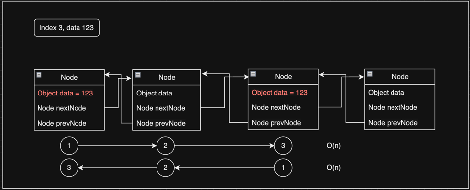

# Linked List

   

## Index

* [Linked List 란?](#Linked-List-란?)
* [LinkedList와 ArrayList의 Big O 비교표](#LinkedList와-ArrayList의-Big-O-비교표)
* [Singly Linked List](#Singly-Linked-List)
* [Doubly Linked List](#Doubly-Linked-List)
* [Circular Linked List](#Circular-Linked-List)

---

   

## Linked List 란?

연결 리스트라고도 불리기도 하며, 각 Node로 연결 되어 있는 자료구조 이다.  
ArrayList의 배열 구조와는 다르게 각 노드의 링크 참조 구조로 되어 있다.

 

### Node 란?
* 데이터와 링크를  객체 이다.
* ~~~java
  class Node {
  
    private Object data;   // 데이터
    private Node nextNode; // 다음 노드
  
    public Node(Object data) {
        this.data = data;
        this.nextNode = null;
    }
  }
  ~~~

 

### Linked List 메모리 할당 이미지

 

### Linked List 를 Json 구조로 비교

~~~json
{
    "data": 1,
    "nextNode": {
        "data": 2,
        "nextNode": {
            "data": 3,
            "nextNode": {
                "data": 4,
                "nextNode": null
            }
        }
    }
}
~~~

 

### Linked List 종류
* [Singly Linked List](#Singly-Linked-List)
* [Doubly Linked List](#Doubly-Linked-List)
* [Circular Linked List](#Circular-Linked-List)

   

## LinkedList와 ArrayList의 Big O 비교표

|              | LinkedList | ArrayList  | Different |
|:-------------|:----------:|:----------:|:---------:|
| Append       |    O(1)    |    O(1)    |           |
| Remove Last  | ***O(n)*** | ***O(1)*** |    <-     |
| Prepend      | ***O(1)*** | ***O(n)*** |    <-     |
| Remove First | ***O(1)*** | ***O(n)*** |    <-     |
| Insert       |    O(n)    |    O(n)    |           |
| Remove       |    O(n)    |    O(n)    |           |
| Lookup Index | ***O(n)*** | ***O(1)*** |    <-     |
| Lookup Value |    O(n)    |    O(n)    |           |

 

### List별 장단점
> ArrayList와 Linked의 차이는 데이터 추가,수정,삭제와 검색에 따라 달라진다.
* ArrayList
  * 추가 및 삭제가 느린 단점이 있지만, 검색이 빠르다는 장점이 있다.
* LinkedList
  * 추가 및 삭제가 빠르다는 장점이 있지만, 검색이 느리다는 단점이 있다.

   

## Singly Linked List

단일 연결 리스트 라고도 불린다.  
[전체 코드 확인하기](https://github.com/chaeheedongs/DataStructure/blob/main/src/c_linked_list/SinglyLinkedList.java)  
[결과 코드 확인하기](https://github.com/chaeheedongs/DataStructure/blob/main/src/c_linked_list/SinglyLinkedListTest.java)

 

### Single Node
* 싱글 노드 구조는 데이터와 다음 노드를 저장하는 Node가 있다.
* ~~~java
  class Node {
  
    private Object data;   // 데이터
    private Node nextNode; // 다음 노드
  
    public Node(Object data) {
        this.data = data;
        this.nextNode = null;
    }
  }
  ~~~
  
 

### Append
* 맨 마지막에 데이터를 추가한다.
* Big O -> O(1)
* ~~~java
    public void append(Object data) {

        // 새로운 노드를 생성
        Node newNode = new Node(data);

        // 데이터가 없다면 Head와 Tail에 새로운 노드를 연결
        if (this.count == 0) {
            this.head = newNode;
            this.tail = newNode;
        }
        // 데이터가 있다면 Tail의 다음 노드와 현재 Tail에 새로운 노드를 연결
        else {
            this.tail.nextNode = newNode;
            this.tail = newNode;
        }

        // 총 길이 1 증가
        this.count = this.count + 1;
    }
  ~~~

 

### Remove Last
* 맨 마지막에 데이터를 삭제한다.
* Big O -> O(n)
* ~~~java
    public Node removeLast() {

        // 데이터가 없다면 null 리턴
        if (this.count == 0) {
            return null;
        }

        // 데이터가 1개 이상 이라면
        Node currentNode = this.head;
        Node swapNode = this.head;

        // 다음 노드가 존재 한다면
        while (currentNode.nextNode != null) {
            // 다음 노드로 이동
            swapNode = currentNode;
            currentNode = currentNode.nextNode;
        }

        // swap Node를 현재 노드로 지정 후 다음 노드를 제거
        currentNode = swapNode;
        currentNode.nextNode = null;

        // 총 길이 1 감소
        this.count = this.count - 1;

        // 갯수가 0개가 되었을 때 모든 노드를 제거
        if (this.count == 0) {
            this.head = null;
            this.tail = null;
        }
        
        // 현재 노드를 반환
        return currentNode;
    }
  ~~~

 

### Prepend
* 맨 앞에 데이터를 추가한다.
* Big O -> O(1)
* ~~~java
    public void prepend(Object data) {

        // 새로운 노드를 생성
        Node newNode = new Node(data);

        // 데이터가 없다면 Head와 Tail에 새로운 노드를 연결
        if (this.count == 0) {
            this.head = newNode;
            this.tail = newNode;
        }
        else {
            newNode.nextNode = this.head;
            this.head = newNode;
        }

        // 총 길이 1 증가
        this.count = this.count + 1;
    }
  ~~~

 

### Remove First
* 맨 앞에 데이터를 제거한다.
* Big O -> O(1)
* ~~~java
    public Node removeFirst() {

        // 데이터가 없다면 null 리턴
        if (this.count == 0) {
            return null;
        }

        // swap용 Node 할당
        Node swapNode = this.head;

        this.head = this.head.nextNode; // 현재 Head를 nextNode로 할당
        swapNode.nextNode = null;       // 이전 Node의 nextNode에 null 할당

        // 총 길이 1 감소
        this.count = this.count - 1;

        // 갯수가 0개가 되었을 때 모든 노드를 제거
        if (this.count == 0) {
            this.tail = null;
        }

        return swapNode;
    }
  ~~~

 

### Get
* Index로 데이터를 조회한다.
* Big O -> O(n)
* ~~~java
    public Node get(int index) {

        // 데이터가 없다면 null 리턴
        if (this.count == 0) {
            return null;
        }
        
        // 찾으려는 index가 0보다 작거나 count보다 크면 null을 반환
        if (index < 0 || index > this.count) {
            return null;
        }
        
        // 첫 노드를 swapNode에 저장
        Node swapNode = this.head;
        
        // 찾으려는 index 길이만큼 노드 이동
        for (int i = 0; i < index; i++) {
            swapNode = swapNode.nextNode;
        }
        
        return swapNode;
    }
  ~~~

 

### Set
* Index의 데이터를 수정한다.
* Big O -> O(n)
* ~~~java
    public boolean set(int index, Object data) {

        // 수정하려는 index의 Node를 조회
        Node findNode = get(index);

        // 찾은 Node의 데이터가 존재한다면 데이터를 수정
        if (findNode != null) {
            findNode.data = data;
            return true;
        }

        return false;
    }
  ~~~

 

### Insert
* Index의 데이터를 추가한다.
* Big O -> O(n)
* ~~~java
    public boolean insert(int index, Object data) {

        // 찾으려는 index가 0보다 작거나 count보다 크면 false를 반환
        if (index < 0 || index > this.count) {
            return false;
        }

        // 데이터가 없다면 맨 앞에 데이터를 추가
        if (this.count == 0) {
            prepend(data);
            return true;
        }

        // Node의 개수와 index가 일치한다면 맨 뒤에 데이터를 추가
        if (this.count == index) {
            append(data);
            return true;
        }

        // 중간에 있다면
        Node newNode = new Node(data); // 새로운 Node를 생성
        Node findNode = get(index - 1);      // 해당 Index의 이전 Node를 조회

        newNode.nextNode = findNode.nextNode;      // 새로운 Node의 nextNode를 변경
        findNode.nextNode = newNode;               // 조회한 Node의 nextNode를 새로운 Node로 변경

        // 총 길이 1 증가
        this.count = this.count + 1;

        return true;
    }
  ~~~
  

 

### Remove
* Index의 데이터를 삭제한다.
* Big O -> O(n)
* ~~~java
    public Node remove(int index) {

        // 찾으려는 index가 0보다 작거나 count보다 크면 null을 반환
        if (index < 0 || index > this.count) {
            return null;
        }

        // index가 0이면 첫 번째 제거
        if (index == 0) {
            return removeFirst();
        }

        // Node의 개수와 index가 일치한다면 맨 뒤에 데이터를 제거
        if (this.count == index) {
            return removeLast();
        }

        Node findNode = get(index - 1);      // 해당 Index Node를 조회
        Node removeNode = findNode.nextNode; // 찾은 Index Node의 다음 노드 조회

        findNode.nextNode = removeNode.nextNode;   // 해당 Index Node의 nextNode를 제거 할 Node의 nextNode로 할당
        removeNode.nextNode = null;                // 제거 할 Node의 nextNode를 null로 할당

        // 총 길이 1 감소
        this.count = this.count - 1;

        return removeNode;
    }
  ~~~

   

## Doubly Linked List

이중 연결 리스트 라고도 불린다.

[전체 코드 확인하기](https://github.com/chaeheedongs/DataStructure/blob/main/src/c_linked_list/DoublyLinkedList.java)  
[결과 코드 확인하기](https://github.com/chaeheedongs/DataStructure/blob/main/src/c_linked_list/DoublyLinkedListTest.java)

### Double Node
* 더블 노드 구조는 데이터와 이전 노드와 다음 노드를 저장하는 Node가 있다.
* ~~~java
  class Node {
  
    private Object data;   // 데이터
    private Node nextNode; // 다음 노드
    private Node prevNode; // 이전 노드
  
    public Node(Object data) {
        this.data = data;
        this.nextNode = null;
        this.prevNode = null;
    }
  }
  ~~~

 

### Append
* 맨 마지막에 데이터를 추가한다.
* Big O -> O(1)
* ~~~java
    public void append(Object value) {

        // 새로운 노드를 생성
        Node newNode = new Node(value);

        // 데이터가 없다면 Head와 Tail에 새로운 노드를 연결
        if (this.count == 0) {
            this.head = newNode;
            this.tail = newNode;
        }
        // 데이터가 있다면 
        // Tail의 다음 노드와 현재 Tail에 새로운 노드를 연결 후
        // Tail을 새 노드의 이전 노드로 할당 후
        // Tail에 새 노드를 저장
        else {
            this.tail.nextNode = newNode;
            newNode.prevNode = this.tail;
            this.tail = newNode;
        }

        // 총 길이 1 증가
        this.count = this.count + 1;
    }
  ~~~

 

### Remove Last
* 맨 마지막에 데이터를 삭제한다. 
* Big O -> O(n)
* ~~~java
    public Node removeLast() {

        // 데이터가 없다면 null 리턴
        if(this.count == 0){
            return null;
        }

        // 데이터가 1개 이상 이라면
        Node currentNode = tail;
        
        // Tail은 Tail 이전 노드를 저장 후
        // Tail의 다음 노드를 제거 후
        // 현재 노드에서 이전 노드를 제거
        this.tail = this.tail.prevNode;
        this.tail.nextNode = null;
        currentNode.prevNode = null;

        // 총 길이 1 감소
        this.count = this.count - 1;

        // 갯수가 0개가 되었을 때 모든 노드를 제거
        if (this.count == 0) {
            this.head = null;
            this.tail = null;
        }

        // 현재 노드를 반환
        return currentNode;
    }  
  ~~~

 

### Prepend
* 맨 앞에 데이터를 추가한다. 
* Big O -> O(1)
* ~~~java
    public void prepend(Object data) {

        // 새로운 노드를 생성
        Node newNode = new Node(data);

        // 데이터가 없다면 Head와 Tail에 새로운 노드를 연결
        if (this.count == 0) {
            this.head = newNode;
            this.tail = newNode;
        }
        // 데이터가 있다면
        // 새 노드의 다음 노드를 Head로 할당 후
        // Head의 이전 노드를 새 노드로 할당 후
        // Head에 새 노드를 저장
        else {
            newNode.nextNode = this.head;
            this.head.prevNode = newNode;
            this.head = newNode;
        }

        // 총 길이 1 증가
        this.count = this.count + 1;
    }
  ~~~

 

### Remove First
* 맨 앞에 데이터를 제거한다.
* Big O -> O(1)
* ~~~java
    public Node removeFirst() {

        // 데이터가 없다면 null 리턴
        if(this.count == 0) {
            return null;
        }

        // 데이터가 있다면
        Node currentNode = this.head;

        // Head는 Head 이후 노드를 저장 후
        // Head의 이전 노드를 제거 후
        // 현재 노드에서 다음 노드를 제거
        this.head = this.head.nextNode;
        this.head.prevNode = null;
        currentNode.nextNode = null;

        // 총 길이 1 감소
        this.count = this.count - 1;

        // 갯수가 0개가 되었을 때 모든 노드를 제거
        if (this.count == 0) {
            this.head = null;
            this.tail = null;
        }

        // 현재 노드를 반환
        return currentNode;
    }
  ~~~

 

### Get
* Index로 데이터를 조회한다. 
* Big O -> O(n)
* ~~~java
    public Node get(int index) {
        
        // 찾으려는 index가 0보다 작거나 count보다 크거나 같으면 null을 반환
        if (index < 0 || index >= this.count) {
            return null;
        }

        // swapNode 생성
        Node swapNode = null;
        
        // Index가 count의 반 값 보다 크면 swapNode를 Head로 저장
        // Index가 count의 반 값 보다 작으면 swapNode를 Tail로 저장 후
        // 다음 또는 이전 노드 검색
        if (index < this.count / 2) {
            swapNode = this.head;
            for (int i = 0; i < index; i++) {
                swapNode = swapNode.nextNode;
            }
        }
        else  {
            swapNode = this.tail;
            for (int i = this.count - 1; i > index; i--) {
                swapNode = swapNode.prevNode;
            }
        }
        
        // 찾은 노드를 리턴
        return swapNode;
    }
  ~~~

 

### Set
* Index의 데이터를 수정한다. 
* Big O -> O(n)
* ~~~java
    public boolean set(int index, Object data) {

        // 수정하려는 index의 Node를 조회
        Node tmp = get(index);

        // 찾은 Node의 데이터가 존재한다면 데이터를 수정
        if (tmp != null) {
            tmp.data = data;
            return true;
        }

        return false;
    }
  ~~~

 

### Insert
* ndex의 데이터를 추가한다. 
* Big O -> O(n)
* ~~~java
    public boolean insert(int index, Object data) {

        // 찾으려는 index가 0보다 작거나 count보다 크면 false를 반환
        if(index < 0 || index > this.count) { 
            return false;
        }

        // 데이터가 없다면 맨 앞에 데이터를 추가
        if (index == 0) {
            prepend(data);
            return true;
        }

        // Node의 개수와 index가 일치한다면 맨 뒤에 데이터를 추가
        if (index == this.count) {
            append(data);
            return true;
        }

        // 중간에 있다면
        Node newNode = new Node(data);        // 새로운 Node를 생성
        Node prev = get(index - 1);           // 해당 Index Node를 조회 후 prev로 저장
        Node next = prev.nextNode;            // prev의 다음 노드를 next로 저장

        newNode.prevNode = prev;    // 새 노드의 이전 노드에 prev 할당
        newNode.nextNode = next;    // 새 노드의 이후 노드에 next 할당
        prev.nextNode = newNode;    // prev의 다음 노드를 새 노드로 할당
        next.prevNode = newNode;    // next의 이전 노드를 새 노드로 할당

        // 총 길이 1 증가
        this.count = this.count + 1;

        return true;
    }  
  ~~~
  

 

### Remove
* Index의 데이터를 삭제한다. 
* Big O -> O(n)
* ~~~java
    public Node remove(int index) {

        // 찾으려는 index가 0보다 작거나 count보다 크거나 같으면 null을 반환
        if(index < 0 || index >= this.count) { 
            return null;
        }

        // index가 0이면 첫 번째 제거
        if(index == 0) {
            return removeFirst();
        }

        // Node의 개수와 index가 일치한다면 맨 뒤에 데이터를 제거
        if(index == this.count - 1) {
            return removeLast();
        }
        
        Node findNode = get(index - 1);      // 해당 Index Node를 조회

        findNode.nextNode.prevNode = findNode.prevNode; // 조회한 노드의 다음 노드의 이전 노드를 조회한 노드의 이전 노드로 할당
        findNode.prevNode.nextNode = findNode.nextNode; // 조회한 노드의 이전 노드의 다음 노드를 조회한 노드의 다음 노드로 할당
        findNode.nextNode = null; // 조회한 노드의 다음 노드를 제거
        findNode.prevNode = null; // 조회한 노드의 이전 노드를 제거

        // 총 길이 1 감소
        this.count = this.count - 1;

        return findNode;
    }
  ~~~

 

   

## Circular Linked List

원형 연결 리스트 라고도 불린다.

[코드 확인하기]()

   
