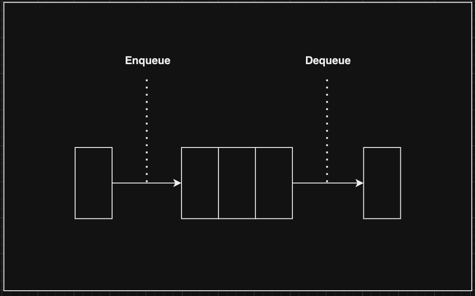
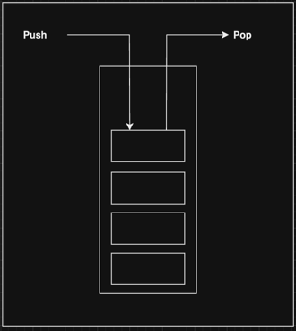

# Queue And Stack

   

## Index

* [Queue란?](#Queue란?)
* [Stack이란?](#Stack이란?)

---

   

## Queue란?

기본적인 자료구조중 하나이며,  
먼저 추가한 데이터가 먼저 출력이 되는 구조를 갖고 있다.  

위 내용을 선입선출(FIFO : First In First Out)이라 부르며,  
놀이동산에 놀이기구를 타기 위한 줄서기 라고 생각하면 편하다.  

줄을 서는 행동은 데이터를 추가하는 행동이며, 이 것을 Enqueue라고 한다.  
순서가 다가와 줄에서 벗어나는 행동은 데이터를 꺼내는 행동이며, 이 것을 Dequeue라고 한다.

[코드 확인하기]()

   

### Enqueue
* 대기 줄에 줄을 서는 행동이다.
* 데이터를 추가하는 행동이다.
* Big O -> O(1)
* ~~~java
    public void enqueue(Object data) {
        
        // 새로운 노드를 생성
        QueueNode newNode = new QueueNode(data);

        // 데이터가 없다면 rear, front에 newNode 할당
        if (this.count == 0) {
            this.rear = newNode;
            this.front = newNode;
        }
        // 데이터가 있다면 front의 다음 노드와 front에 newNode 할당
        else {
            this.front.nextNode = newNode;
            this.front = newNode;
        }

        // 총 길이 1 증가
        this.count = this.count + 1;
    }
  ~~~ 

   

### Dequeue
* 순서가 다가와 줄에서 벗어나는 행동이다.
* 데이터를 꺼내는 행동이다.
* Big O -> O(1)
* ~~~java
    public QueueNode dequeue() {

        // 데이터가 없다면 null 리턴
        if (this.count == 0) {
            return null;
        }
        
        QueueNode tmpNode = this.rear;
        
        // 데이터가 1개라면 rear, front 제거
        if (this.count == 1) {
            this.rear = null;
            this.front = null;
        }
        // 데이터가 여러개라면 rear를 rear의 다음 노드로 할당 후 tmpNode의 다음 노드 제거 
        else {
            this.rear = this.rear.nextNode;
            tmpNode.nextNode = null;
        }

        // 총 길이 1 감소
        this.count = this.count - 1;
        
        return tmpNode;
    }
  ~~~

   

## Stack이란?

기본적인 자료구조중 하나이며,  
먼저 추가한 데이터가 나중에 출력이 되는 구조를 갖고 있다.  
즉 늦게 추가한 데이터가 먼저 출력이 되는 구조이다.  

위 내용을 후입선출(LIFO : Last In First Out)이라 부르며,  
프링글스 과자통에 담긴 과자라고 생각하면 편하다.  

프링글스 과자통에 과자를 담는 행동은 데이터를 추가하는 행동이며, 이 것을 Push라고 한다.  
프링글스 과자통에 과자를 꺼내는 행동은 데이터를 꺼내는 행동이며, 이 것을 Pop이라 한다.  

[코드 확인하기]()

   

### Push
* 프링글스 과자통에 과자를 담는 행동이다.
* 데이터를 추가하는 행동이다.
* Big O -> O(1)
* ~~~java
    public void push(Object data) {

        // 새로운 노드를 생성
        StackNode newNode = new StackNode(data);

        // 데이터가 없다면
        if (this.count == 0) {
            this.top = newNode;
        }
        // 데이터가 있다면
        else {
            newNode.nextNode = this.top;
            this.top = newNode;
        }

        // 총 길이 1 증가
        this.count = this.count + 1;
    }
  ~~~

   

### Pop
* 프링글스 과자통에 과자를 꺼내는 행동이다.
* 데이터를 추출하는 행동이다.
* Big O -> O(1)
* ~~~java
    public StackNode pop() {

        // 데이터가 없다면 null 반환
        if (this.count == 0) {
            return null;
        }
        
        // 맨 위 데이터를 기준으로 노드를 생성 후
        // top을 다음 노드로 할당 후
        // 기존 노드의 다음 노드를 null로 할당
        StackNode tmp = this.top;
        this.top = this.top.nextNode;
        tmp.nextNode = null;

        // 총 길이 1 감소
        this.count = this.count - 1;

        return tmp;
    }
  ~~~

   