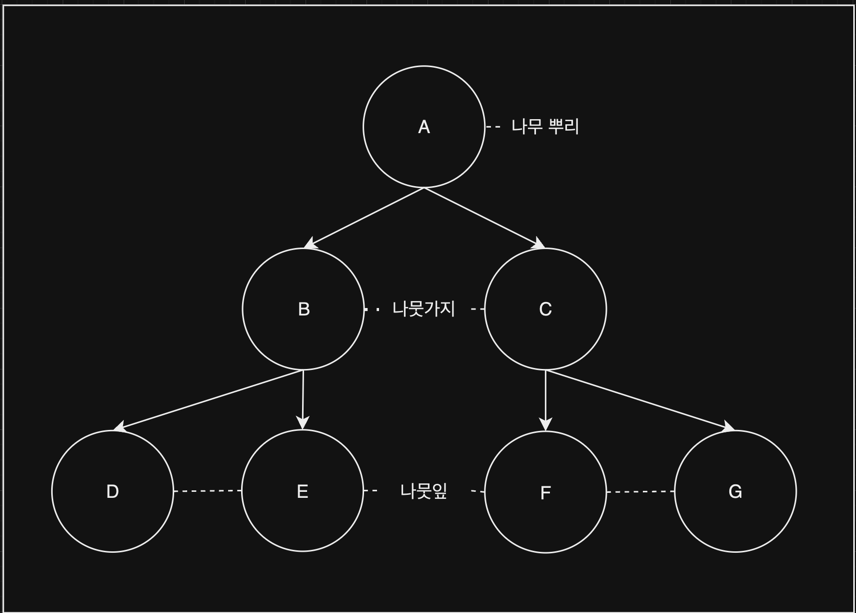
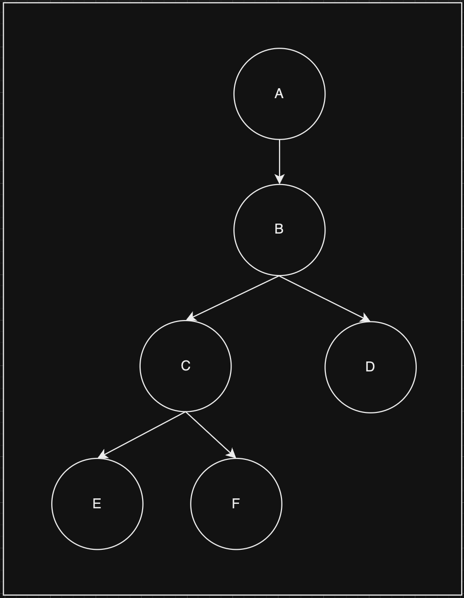
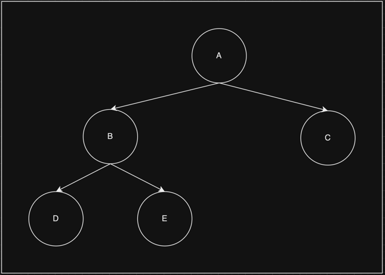
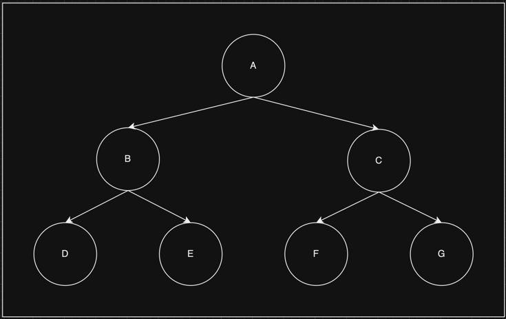
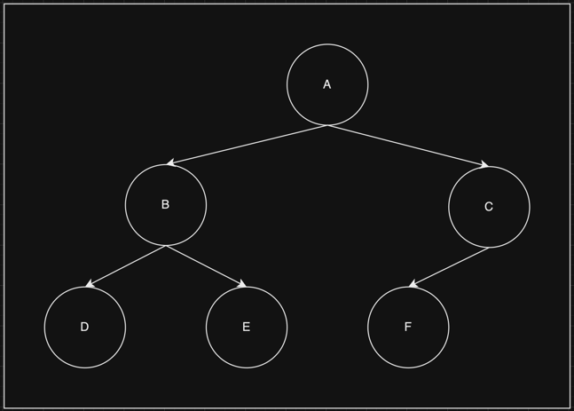

# Tree

   

## Index

* [Tree 란?](#Tree-란?)
* [Tree 특징](#Tree-특징)

---

   

## Tree 란?

나무를 거꾸로 한 모양과 비슷하여 Tree라고 부른다.  

Tree는 나무 뿌리, 가지, 잎이 존재하며, 각각을 노드라고 부른다.  

나무 뿌리는 최상위 노드이며, **루트 노드(A)** 라고 한다.  
나뭇가지는 상위(부모)와 하위(자식)를 모두 갖고 있는 노드이며, **내부 노드(B, C)** 라고 한다.  
나뭇잎은 하위(자식)가 없는 노드이며, **리프 노드(D, E, F, G)** 라고 한다.

위에서 이야기 하듯 각각(A, B, C ...)을 노드라고 부른다.  

위 그림으로 각 노드별 부모, 자식 노드를 구분 해보자.  

B노드의 부모 노드는 A노드가 되며, 자식 노드는 C, D노드가 되며,  
C노드의 부모 노드는 B노드가 되며, 자식 노드는 E, F노드가 된다.  
물론 A노드는 루트노드가 되며, D, E, F노드는 리프 노드가 된다.

위의 두 그림은 부모 노드 1개와 자식 노드 2개로 이루어져 있으며, 이를 이진 트리라고 부른다.

트리의 종류는 다양 하지만 이해 하기 쉽도록 이진트리(Binary Tree)로 예를 들어 본다.

   

## Tree 특징

> Tree의 특징으로 Full, Perfect, Complete 특징이 존재한다.

 

### Full Binary Tree

Full Binary Tree 라고 하며, **각 노드의 자식 노드가 0개 또는 2개**인 트리를 말한다.

 

### Perfect Binary Tree

Perfect Binary Tree 라고 하며, **리프노드가 같은 뎁스에 있고, Full Binary Tree 구조를 갖고 있다.**

 

### Complete Binary Tree

Complete Binary Tree 라고 하며, **리프노드가 같은 뎁스에 있고, 왼쪽부터 채워져 있어야 한다.**

   

