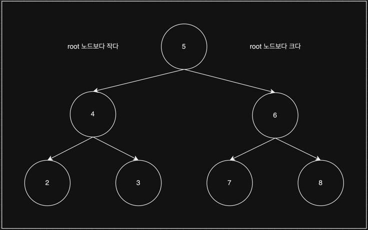
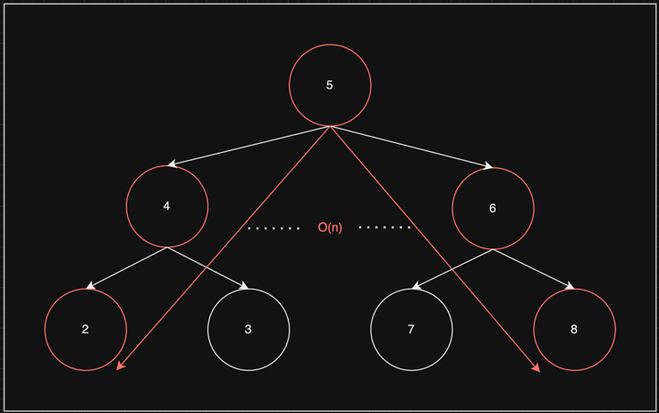
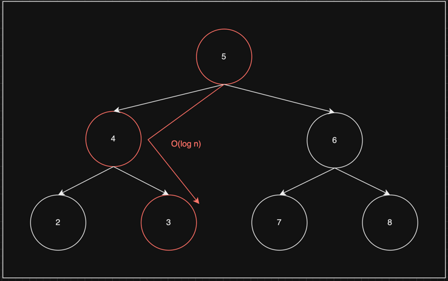

# Binary Search Tree

   

## Index

* [Binary Search Tree](#Binary-Search-Tree)
* [Big O Notation](#Big-O-Notation)
* [Insert](#Insert)
* [Contains](#Contains)

---

   

## Binary Search Tree 

앞자를 따서 BST 라고도 불리기도 한다.

Binary Tree 특징인 1부모 2자식으로 구성되어 있으며,  
Tree의 데이터가 정렬이 되어 있다.  

루트노드를 기준으로 왼쪽은 루트노드보다 데이터가 작고 오른쪽은 데이터가 크다.  

[코드 확인하기](https://github.com/chaeheedongs/DataStructure/blob/main/src/e_binary_search_tree/BinarySearchTree.java)

   

## Big O Notation

* O(n): 제일 높거나 낮은 값으로 계속 조회

 

* O(log n): 중간 값으로 조회

   

## Insert
* Binary Search Tree에 데이터를 추가한다.
* 임시노드를 루트노드로 할당 후 크기비교하여 빈 노드를 찾아가 추가한다.
* ~~~java
    public boolean insert(int data) {
        // 새로운 노드를 생성
        BinaryNode newNode = new BinaryNode(data);

        if (this.root == null) {
            this.root = newNode;
            return true;
        }

        // root 노드를 임시 노드로 지정
        BinaryNode tmp = this.root;

        while (true) {

            // 새 노드의 데이터가 임시노드의 데이터와 같으면 false 리턴(중복)
            if (newNode.data == tmp.data) {
                return false;
            }

            // 새 노드의 데이터가 임시노드의 데이터보다 작으면
            if (newNode.data < tmp.data) {

                // 임시노드의 왼쪽이 비었으면 할당
                if (tmp.left == null) {
                    tmp.left = newNode;
                    return true;
                }

                // 임시노드가 비어있지 않으면 왼쪽의 임시노드 재할당
                tmp = tmp.left;
            }
            // 새 노드의 데이터가 임시노드의 데이터보다 크면
            else {
                // 임시노드의 오른쪽이 비었으면 할당
                if (tmp.right == null) {
                    tmp.right = newNode;
                    return true;
                }

                // 임시노드가 비어있지 않으면 오른쪽의 임시노드 재할당
                tmp = tmp.right;
            }

        }
    }
  ~~~

   

## Contains
* Binary Search Tree에 데이터를 조회한다.
* 임시노드를 루트노드로 할당 후 크기비교하여 조회하는 값의 노드를 찾아간다.
* ~~~java
    public boolean contains(int value) {

        // root 노드가 없으면 false 리턴
        if (this.root == null) {
            return false;
        }

        // root 노드를 임시 노드로 지정
        BinaryNode tmp = this.root;

        // 임시노드가 비어있지 않으면
        while (tmp != null) {

            // 조회하는 값이 임시노드의 데이터보다 작으면
            if (value < tmp.data) {
                // 왼쪽으로 뎁스 이동
                tmp = tmp.left;
            }
            // 조회하는 값이 임시노드의 데이터보다 크면
            else if (value > tmp.data) {
                // 오른쪽으로 뎁스 이동
                tmp = tmp.right;
            }
            // 조회하는 값이 임시노드의 데이터와 같으면
            else {
                return true;
            }

        }

        return false;
    }
  ~~~
