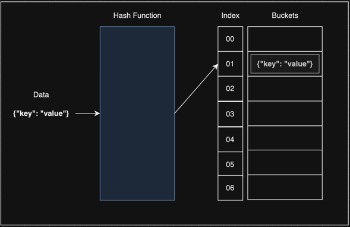

# Hash Table

   

## Index

* [Hash Table 이란?](#Hash-Table-이란?)
* [Hash Function](#Hash-Function)
* [Hash 충돌](#Hash-충돌)
* [Set [Separate Chaning]](#Set)
* [Remove [Separate Chaning]](#Remove)
* [Get [Separate Chaning]](#Get)
* [Keys [Separate Chaning]](#Keys)

---

   

## Hash Table 이란?

Hash Table 이란 ***Key Value Pair*** 로 데이터를 저장하는 자료구조중 하나이다.  
여기서 Key Value Pair란 키와 값으로 이루어진 데이터 이다.  

***{"key": "value"}*** 의 데이터 중 키값을 기반으로  
Hash Function 생성 함수를 타고 Index 가 생성 되며,  
해당 Index의 공간에 ***{"key": "value"}*** 가 저장 된다.  
***Index가 있어 Big O Notation 으로 O(1) 이다.*** 

인덱스의 데이터가 저장되는 공간을 ***버킷(buckets)*** 이라고 한다.

[코드 확인하기](https://github.com/chaeheedongs/DataStructure/blob/main/src/f_hash_table/HashTable.java)  
[결과 코드 확인하기](https://github.com/chaeheedongs/DataStructure/blob/main/src/f_hash_table/HashTableTest.java)

   

## Hash Function
Hash Function은 ***데이터가 버킷에 저장 될 Index를 계산***하는 함수 이다.  
Index를 계산하는 방식은 4가지가 존재 한다.  

* Division Method
* Digit Folding
* Multiplication Method
* Univeral Hashing

   

## Hash 충돌
Hash Collision 이라고 하며, 말 그대로 해쉬가 충돌한 것 이다.  
Hash가 충돌하면 크게 아래 두 가지 방식으로 대응 할 수 있다.

* [Separate Chaning [분리 연결법]](#Separate-Chaning)
* [Open Addressing [개방 주소법]](#Open-Addressing)

 

### Separate Chaning

Separate Chaning 방식은 Hash Collision 이 발생할 경우  
해당 Index의 버킷에 Linked List 형식으로 데이터를 저장한다.

 

### Open Addressing

Open Addressing 방식은 Hash Collision 이 발생할 경우  
다른 버킷에 데이터를 저장한다.  

데이터를 저장할 버킷을 찾는 방법은 아래 방식이 있다.
* Linear Probing
* Quadratic Probing
* Double Hashing

   

## Set
* Hash Table에 데이터를 추가한다.
* ~~~java
    private void set(String key, Object value) {
        
        // 인덱스 생성
        int index = hash(key);
        
        // 매개변수 key, value로 새로운 노드를 생성
        HashTableNode newNode = new HashTableNode(key, value);
        
        // Hash Table Map에 데이터가 없다면
        if (this.hashTableMap[index] == null) {
            // 새로운 노드를 할당
            this.hashTableMap[index] = newNode;
        }
        // Hash Table Map에 데이터가 있다면
        else {
            // Hash Table Map의 첫 노드를 tmp로 할당
            HashTableNode tmp = this.hashTableMap[index];
            // 다음 노드가 비어있지 않을때 까지 순환
            while (tmp.next != null) {
                tmp = tmp.next;
            }
            
            // 다음 노드가 빈 노드를 찾아 다음 노드를 새 노드로 할당
            tmp.next = newNode;
        }
    }
  ~~~

   

## Remove
* Hash Table에 데이터를 삭제한다.
* ~~~java
    public boolean remove(String key) {

        // 인덱스 생성
        int index = hash(key);

        // Hash Table Map의 첫 노드를 tmp로 할당
        HashTableNode tmp = this.hashTableMap[index];

        // 다음 노드가 비어있지 않을때 까지 순환
        while (tmp != null) {
            // 노드의 키값이 매개변수의 키 값이랑 같은지 확인
            if (tmp.key.equals(key)) {
                // 노드의 key, value 값 제거
                tmp.key = null;
                tmp.value = null;
                
                // 다음 노드가 없으면 HashTable Index 제거 
                if (tmp.next == null) {
                    this.hashTableMap[index] = null;
                }
                // 다음 노드가 있으면 tmp를 다음 노드로 할당
                else {
                    tmp = tmp.next;
                }
                
                // 삭제 성공
                return true;
            }
            
            // 다음 노드로 할당 하여 순환
            tmp = tmp.next;
        }

        // 삭제 실패
        return false;
    }
  ~~~
  
   

## Get
* Hash Table에 Key 값을 조회한다.
* ~~~java
    public Object get(String key) {

        // 인덱스 생성
        int index = hash(key);

        // Hash Table Map의 첫 노드를 tmp로 할당
        HashTableNode tmp = this.hashTableMap[index];

        // 다음 노드가 비어있지 않을때 까지 순환
        while (tmp != null) {
            // 노드의 키값이 매개변수의 키값이랑 같은지 확인
            if (tmp.key.equals(key)) {
                // 같으면 값 반환
                return tmp.value;
            }

            // 같지 않으면 다음 노드로 할당하여 순환
            tmp = tmp.next;
        }

        // 없으면 null 리턴
        return null;
    }
  ~~~

   

## Keys
* Hash Table의 모든 키를 조회한다.
* ~~~java
    public List keys() {

        // 빈 ArrayList 생성
        ArrayList keyList = new ArrayList<>();

        // HashTable의 사이즈만큼 순환
        for (int idx = 0; idx < this.size; idx++) {

            // HashTable의 첫 인덱스를 tmp로 할당
            HashTableNode tmp = this.hashTableMap[idx];
            // tmp가 비어있지 않으면 순환
            while (tmp != null) {
                // tmp의 key값을 ArrayList에 추가
                keyList.add(tmp.key);

                tmp = tmp.next;
            }
        }

        // 키 리스트 반환
        return keyList;
    }
  ~~~
  
   

