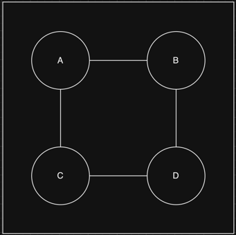
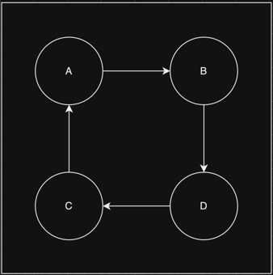
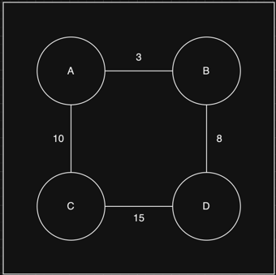
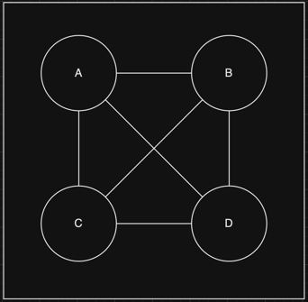
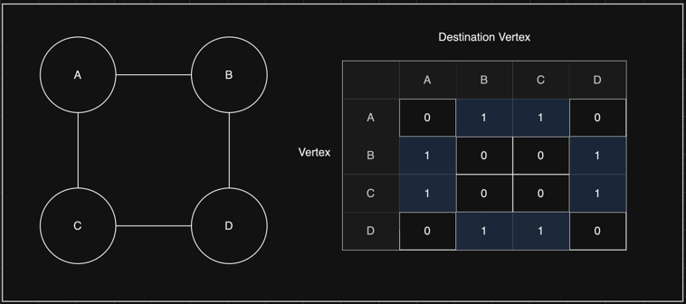
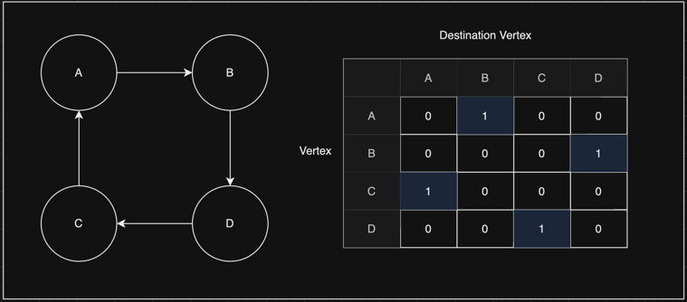
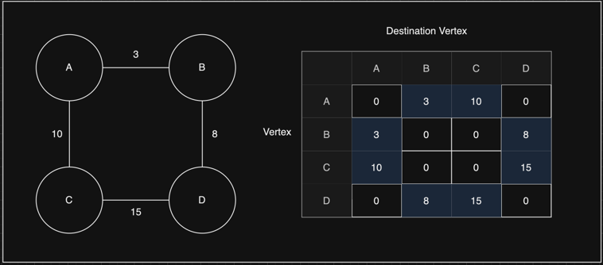
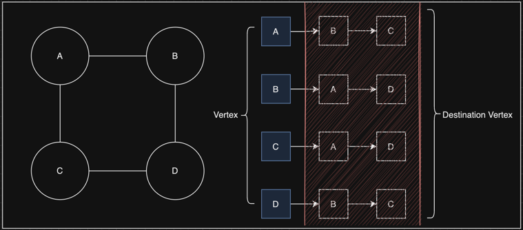
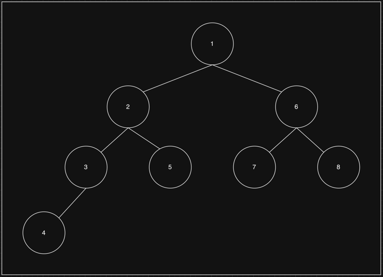
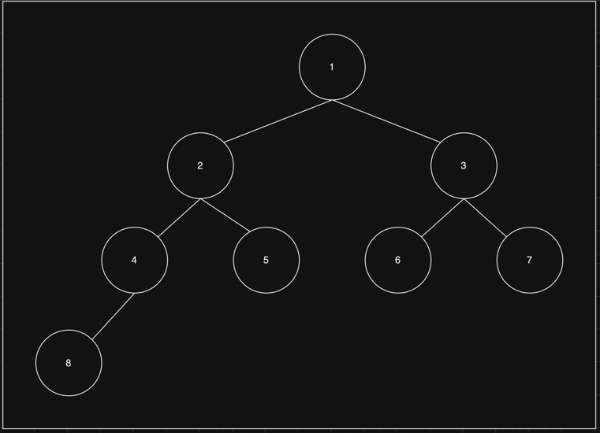

# Graph

   

## Index

* [Graph 란?](#Graph-란?)
* [Graph 키워드](#Graph-키워드)
* [Graph 종류](#Graph-종류)
* [Graph 구현](#Graph-구현)
* [Graph 탐색법](#Graph-탐색법)
* [Add Vertex](#Add-Vertex)
* [Add Edge](#Add-Edge)
* [Remove Vertex](#Remove-Vertex)
* [Remove Edge](#Remove-Edge)

---

   

## Graph 란?

Graph란 정점(Vertex, Node)과 간선(Edge)으로 이루어진 자료구조다.  

정점은 동그란 원으로 표기 하며,  
간선은 정점과 정점 사이를 연결하는 선으로 표기 한다.  

간선은 단 방향이 될 수도 있고 양 방향이 될 수도 있다.  

[코드 확인하기]()  
[결과 코드 확인하기]()

   

## Graph 키워드

|    이름 | 키워드             | 설명                                |
|------:|:----------------|:----------------------------------|
|    정점 | Vertex, Node    | 데이터를 나타내는 그래프의 기본 원소              |
|    간선 | Edge            | 정점간의 관계                           |
| 인접 정점 | Adjacent Vertex | 간선에 의해 연결되는 양쪽 정점                 |
| 단순 경로 | Simple Path     | 반복되는 정점이 없는 경로                    |
| 경로 길이 | Path Length     | 경로를 구성하는 간선의 수                    |
|    차수 | Degree          | 무 방향 그래프에서 한 정점에 인접한 정점의 개수       |
| 진출 차수 | Out-Degree      | 방향 그래프에서 기준 정점에서 타 정점으로 연결된 간선의 수 |
| 진입 차수 | In-Degree       | 방향 그래프에서 타 정점에서 기준 정점으로 연결된 간선의 수 |
|   싸이클 | Cycle           | 경로의 시작과 끝이 같은 경로                  |

   

## Graph 종류

> 무방향 그래프 (Undirected Graph)

 

> 방향 그래프 (Directed Graph)

 

> 가중치 그래프 (Weighted Graph)  

 

> 완전 그래프 (Complete Graph)

   

## Graph 구현

> 인접 행렬 (Adjacency Matrix)

Graph를 행렬로 나타내는 방식이다.  
Y 축은 정점을 나타내고 X 축은 Y 축이 이동할 수 있는 간선을 나타낸다.  

방향, 무방향 그래프는 이동할 수 있으면 1, 없으면 0으로 표기하며,  
가중치 그래프에서는 가중치를 표기한다.

 

> 인접 리스트 (Adjacency List)

Graph를 리스트로 나타내는 방식이다.

Linked List의 1차원 배열이며,  
첫 노드를 기준으로 이동할 수 있는 정점을 표현 한다.

   

## Graph 탐색법

> 깊이 우선 탐색 (DFS)

루트 노드를 기준으로 왼쪽 방향으로 리프 노드를 만날때 까지 탐색 한다.  
리프 노드를 만나면 다시 올라와 오른쪽 방향으로 리프 노드를 만날때 까지 탐색 한다.

스택 또는 재귀 함수를 이용해서 구현 한다.

 

> 너비 우선 탐색 (BFS)

루트 노드를 기준으로 왼쪽에서 오른쪽 방향으로 자식 노드를 탐색 한다.  

큐를 이용해서 구현 한다.

   

## Add Vertex
* 정점을 추가 한다.
* ~~~java
    public boolean addVertex(String vertex) {
        if (adjcencyList.get(vertex) == null) {
            adjcencyList.put(vertex, new ArrayList<>());
            return true;
        }

        return false;
    }
  ~~~
  

   

## Add Edge
* 간선을 추가 한다.
* ~~~java
    public boolean addEdge(String vertex, String destinationVertex) {

        ArrayList<String> startVertex = adjcencyList.get(vertex);
        ArrayList<String> endVertex = adjcencyList.get(destinationVertex);

        if (startVertex != null && endVertex != null) {
            adjcencyList.get(vertex).add(destinationVertex);
            adjcencyList.get(destinationVertex).add(vertex);
            return true;
        }

        return false;
    }
  ~~~
  

   

## Remove Vertex
* 정점을 삭제 한다.
* ~~~java
    public boolean removeVertex(String vertex) {
        ArrayList<String> target = adjcencyList.get(vertex);

        if (target == null) {
            return false;
        }

        for (String destinationVertex : target) {
            adjcencyList.get(destinationVertex).remove(vertex);
        }

        adjcencyList.remove(vertex);

        return false;
    }
  ~~~
  

   

## Remove Edge
* 간선을 삭제 한다.
* ~~~java
    public boolean removeEdge(String vertex, String destinationVertex) {

        ArrayList<String> startVertex = adjcencyList.get(vertex);
        ArrayList<String> endVertex = adjcencyList.get(destinationVertex);

        if (startVertex != null && endVertex != null) {
            startVertex.remove(destinationVertex);
            endVertex.remove(vertex);
            return true;
        }

        return false;
    }
  ~~~
  

