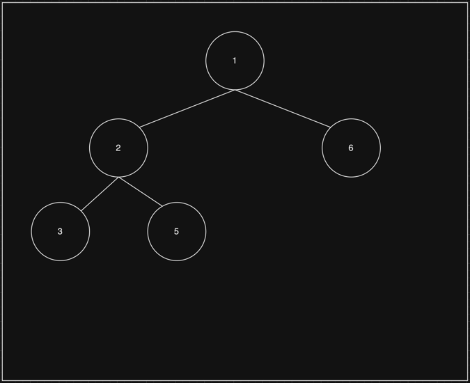
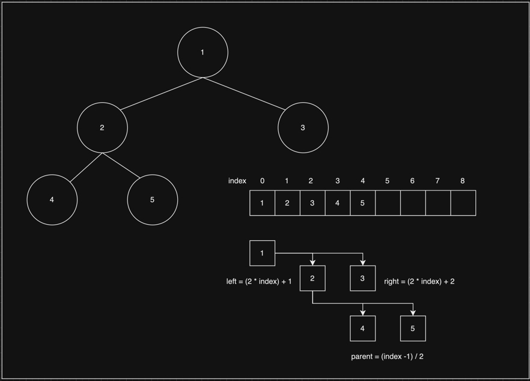

# Heap

   

## Index

* [Heap 이란?](#Heap-이란?)
* [Heap 종류](#Heap-종류)
* [Heap 공식](#Heap-공식)
* [Insert](#Insert)
* [Remove](#Remove)

---

   

## Heap 이란?

힙(Heap) 이란 최대값 및 최소값을 빠르게 찾기 위한 자료구조 이다.  
위 그림 처럼 완전 이진 트리로 구성되어 있다.  
힙의 장점으로 값을 검색할 때 O(log n) 으로 값을 찾을 수 있다.

[코드 확인하기](https://github.com/chaeheedongs/DataStructure/blob/main/src/h_heap/Heap.java)  
[결과 코드 확인하기](https://github.com/chaeheedongs/DataStructure/blob/main/src/h_heap/HeapTest.java)

   

## Heap 종류

> Max-Heap

* 루트 노드의 값이 가장 크다.
* 리프 노드 값은 부모 노드 값 보다 클 수 없다.

 

> Min-Heap

* 루트 노드의 값이 가장 작다.
* 리프 노드 값은 부모 노드 값 보다 크다.

   

## Heap 공식

* parent :: (index - 1) / 2
* left :: (2 * index) + 1
* right :: (2 * index) + 2

   

## Insert

* Heap에 데이터를 추가한다.
* Big O -> O(log n)
* ~~~java
    public void insert(int data) {

        this.heap.add(data);                     // 맨 마지막 인덱스에 데이터를 추가
        int currentIndex = this.heap.size() - 1; // 추가한 데이터의 인덱스 조회

        while (true) {

            // 조건 1 : 현재 인덱스가 0보다 큰가
            boolean isIndexGreaterThanZero = currentIndex > 0;
            // 조건 2 : 현재 인덱스의 데이터가 부모 데이터보다 큰가
            boolean isIndexGreaterThanParentIndex = this.heap.get(currentIndex) > this.heap.get(parent(currentIndex));
            
            // 조건이 맞다면
            if (isIndexGreaterThanZero && isIndexGreaterThanParentIndex) {
                swap(currentIndex, parent(currentIndex)); // 현재 인덱스와 부모 인덱스를 교환
                currentIndex = parent(currentIndex);      // 현재 인덱스를 부모 인덱스로 할당
            }
            // 조건이 틀리면
            else {
                return;
            }
        }
    }
  ~~~

   

## Remove

* Heap에 데이터를 제거한다.
* Big O -> O(log n)
* ~~~java
    public Integer remove() {
  
        // 힙 크기가 0이면 0 반환
        if (this.heap.size() == 0){
            return 0;
        }

        // 힙 크기가 1개밖에 없다면 그냥 제거
        if(this.heap.size() == 1) {
            return this.heap.remove(0);
        }

        // 루트 노드 조회
        int maxValue = this.heap.get(0);
        // 트리의 오른쪽 마지막 리프 노드를 루트 노드로 할당
        this.heap.set(0, this.heap.remove(this.heap.size() - 1));
        // 힙 재 계산
        reCalculate(0);

        // 초기 루트 노드 값 반환
        return maxValue;
    }
  ~~~

   
