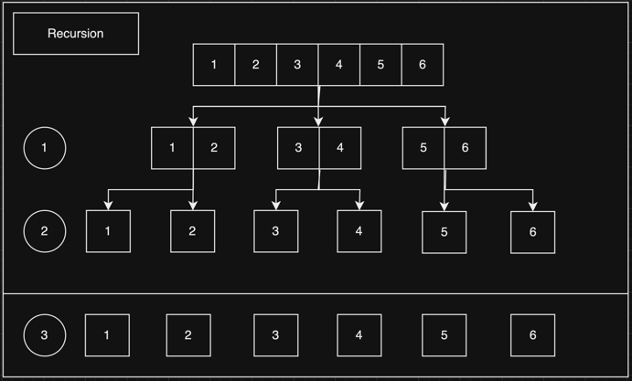

# Sort

   

## Index

* [Sort 란?](#Sort-란?)
* [Sort 종류](#Sort-종류)
* [Sort 시간복잡도](#Sort-시간복잡도)
* [Bubble Sort](#Bubble-Sort)
* [Selection Sort](#Selection-Sort)
* [Insertion Sort](#Insertion-Sort)
* [Merge Sort](#Merge-Sort)

---

   

## Sort 란?
데이터의 특정 조건을 기준으로 정렬을 하는 것 이다.  
정렬 조건으로 오름차순과 내림차순이 있다.  

사전을 보면 a ~ z 순서로 나열이 되어 있는 것을 확인할 수 있다.  
앞에서 끝으로 가는 순서를 오름차순(Ascending) 이라고 하며,  
끝에서 앞으로 가는 순서를 내림차순(Descending) 이라고 한다.

   

## Sort 종류
* [Bubble Sort (버블 정렬)](#Bubble-Sort)
* [Selection Sort (선택 정렬)](#Selection-Sort)
* [Insertion Sort (삽입 정렬)](#Insertion-Sort)
* [Merge Sort (병합 정렬)](#Merge-Sort)

   

## Sort 시간복잡도

|   Sort    |    Best    |    Arg     |   Worst    | sec |
|:---------:|:----------:|:----------:|:----------:|:---:|
|  Bubble   |   O(n²)    |   O(n²)    |   O(n²)    | 30  |
| Selection |   O(n²)    |   O(n²)    |   O(n²)    | 15  |
| Insertion |   O(n²)    |   O(n²)    |   O(n²)    |  7  |
|   Merge   | O(log₂(n)) | O(log₂(n)) | O(log₂(n)) | 0.3 |

   

## Bubble Sort

[코드 확인하기](https://github.com/chaeheedongs/DataStructure/blob/main/src/j_sort/BubbleSort.java)

* 버블 정렬 이라고 부른다.
* Sort 알고리즘 중에서 제일 느리고 좋지 않다.
* Big O -> O(n²)
* ~~~java
    // 내림차순
    if (ASC.equals(cending)) {
        for (int i = 1; i < array.length; i++) {
            for (int j = 0; j < array.length - i; j++) {

                // index 계산
                int current = j;
                int next = j + 1;

                // 조건부 스왑
                if (array[current] > array[next]) {
                    int swap = array[current];
                    array[current] = array[next];
                    array[next] = swap;
                }
            }
        }
    }
    // 오름차순
    else if (DESC.equals(cending)) {
        for (int i = 1; i < array.length; i++) {
            for (int j = 0; j < array.length - i; j++) {

                // index 계산
                int current = j;
                int next = j + 1;
                
                // 조건부 스왑
                if (array[current] < array[next]) {
                    int swap = array[current];
                    array[current] = array[next];
                    array[next] = swap;
                }
            }
        }
    }
  ~~~

   

## Selection Sort

[코드 확인하기](https://github.com/chaeheedongs/DataStructure/blob/main/src/j_sort/SelectionSort.java)

* 선택 정렬 이라고 부른다.
* Sort 알고리즘 중에서 버블 정렬 다음으로 빠르지만 느리고 좋지 않다.
* Big O -> O(n²)
* ~~~java
    // 내림차순
    if (ASC.equals(cending)) {
        for (int i = 1; i < array.length; i++) {

            int currentIndex = i - 1;
            int minIndex = currentIndex;

            for (int j = 0; j < array.length - i; j++) {

                // index 계산
                int current = j;
                int next = j + 1;

                // 값 비교
                if (array[current] > array[next]) {
                    minIndex = next;
                }
            }

            // 조건부 스왑
            if (currentIndex != minIndex) {
                int swap = array[currentIndex];
                array[currentIndex] = array[minIndex];
                array[minIndex] = swap;
            }
        }
    }
    // 오름차순
    else if (DESC.equals(cending)) {
        for (int i = 1; i < array.length; i++) {

            int currentIndex = i - 1;
            int maxIndex = currentIndex;

            for (int j = 0; j < array.length - i; j++) {

                // index 계산
                int current = j;
                int next = j + 1;

                // 값 비교
                if (array[current] < array[next]) {
                    maxIndex = next;
                }
            }

            // 조건부 스왑
            if (currentIndex != maxIndex) {
                int swap = array[currentIndex];
                array[currentIndex] = array[maxIndex];
                array[maxIndex] = swap;
            }
        }
    }
  ~~~

   

## Insertion Sort

[코드 확인하기](https://github.com/chaeheedongs/DataStructure/blob/main/src/j_sort/InsertionSort.java)

* 삽입 정렬 이라고 부른다.
* Sort 알고리즘 중에서 버블, 선택 정렬 다음으로 빠르지만 느리고 좋지 않다.
* Big O -> O(n)
* ~~~java
    // 내림차순
    if (ASC.equals(cending)) {
        for (int i = 1; i < array.length; i++) {
            // index 계산
            int current = i;
            int prev = i - 1;
            
            boolean flag = true;

            // 조건부 스왑
            while (array[current] < array[prev] && flag) {
                
                int swap = array[prev];
                array[prev] = array[current];
                array[current] = swap;

                if (prev == 0) {
                    flag = false;
                }
                else {
                    prev = prev - 1;
                    current = current - 1;
                }
            }
        }
    }
    // 오름차순
    else if (DESC.equals(cending)) {
        for (int i = 1; i < array.length; i++) {
            // index 계산
            int current = i;
            int prev = i - 1;

            boolean flag = true;

            // 조건부 스왑
            while (array[current] > array[prev] && flag) {

                int swap = array[prev];
                array[prev] = array[current];
                array[current] = swap;

                if (prev == 0) {
                    flag = false;
                }
                else {
                    prev = prev - 1;
                    current = current - 1;
                }
            }
        }
    }
  ~~~
   

## Merge Sort

[코드 확인하기](https://github.com/chaeheedongs/DataStructure/blob/main/src/j_sort/MergeSort.java)

* 병합 정렬 이라고 부른다.
* 재귀 방식을 활용한 정렬 방식이다.
* 빠른 정렬 방식 중 하나이다.
* Big O -> O(log₂(n))
* ~~~java
    public static int[] mergeSort(int[] array, String cending) {

        int arrLength = array.length;

        if(arrLength == 1)
            return array;

        // 중간 인덱스 조회
        int middleIndex = arrLength / 2;
        
        // 왼, 오른 쪽 배열 생성
        int[] leftArr = Arrays.copyOfRange(array, 0, middleIndex);
        int[] rightArr = Arrays.copyOfRange(array, middleIndex, arrLength);
        
        // 재귀로 왼, 오른 쪽 배열의 길이가 1이 되도록 쪼개기
        int[] left = mergeSort(leftArr, cending);
        int[] right = mergeSort(rightArr, cending);

        // 쪼갠 배열 합치기
        return merge(left, right, cending);
    }

    public static int[] merge(int[] left, int[] right, String cending) {
        
        // 응답 할 변수 및 인덱스 초기화
        int[] mergeArr = new int[left.length + right.length];
        int index = 0;
        int leftIdx = 0;
        int rightIdx = 0;

        // 내림차순
        if (ASC.equals(cending)) {
            // 왼 쪽과 오른 쪽의 길이가 인덱스보다 크면
            while (leftIdx < left.length && rightIdx < right.length) {
                // 오른 쪽이 크면
                if (left[leftIdx] < right[rightIdx]) {
                    mergeArr[index] = left[leftIdx];
                    leftIdx = leftIdx + 1;
                }
                // 왼 쪽이 크면
                else {
                    mergeArr[index] = right[rightIdx];
                    rightIdx = rightIdx + 1;
                }
                index = index + 1;
            }
        }
        // 오름차순
        else if (DESC.equals(cending)) {
            while (leftIdx < left.length && rightIdx < right.length) {
                // 왼 쪽이 크면
                if (left[leftIdx] > right[rightIdx]) {
                    mergeArr[index] = left[leftIdx];
                    leftIdx = leftIdx + 1;
                }
                // 오른 쪽이 크면
                else {
                    mergeArr[index] = right[rightIdx];
                    rightIdx = rightIdx + 1;
                }
                index = index + 1;
            }
        }
        
        // 남은 배열 정리
        while (leftIdx < left.length) {
            mergeArr[index] = left[leftIdx];
            index = index + 1;
            leftIdx = leftIdx + 1;
        }

        while (rightIdx < right.length) {
            mergeArr[index] = right[rightIdx];
            index = index + 1;
            rightIdx = rightIdx + 1;
        }

        return mergeArr;
    }
  ~~~

   

